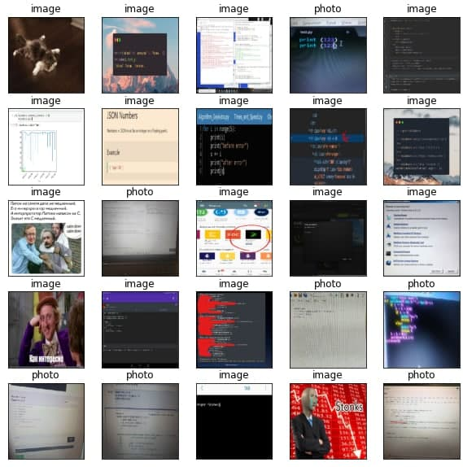

# antiphotobot
### Telegram bot which checks the image in chat for the fact that it is a photo of the monitor or screenshot.

[Live demo](https://awitwicki.github.io/deep-learning-examples/image-photo-classifier/)

Based on Aiogram and tensorflow
## Install

Use next environment variables:

* `ANTIPHOTOSBOT_TELEGRAM_TOKEN={YOUR_TOKEN}` - telegram token

    (other variables is not necessary and have default values)

* `ANTIPHOTOSBOT_ALLOWED_CHATS=-10010101,-10000101010` - whitelist chats. If it empty or not added to envs, whitelist mode will be turned off.

* `MINIO_ROOT_USER, MINIO_ROOT_PASSWORD` credentials for minio server

* `MINIO_ACCESS_KEY MINIO_SECRET_KEY` - log in into minio panel, create new access key and secret key, and add it to envs.

**Python:** Add to system environment that variables.

**Docker compose:**  create `.env` file and fill it with that variables.

## Run

Then run in console command:

1. `docker-compose up` Run in docker container
2. Open `http://localhost:9000` log in to minio and create new access key
3. Add it to .env file
4. Restart docker container

