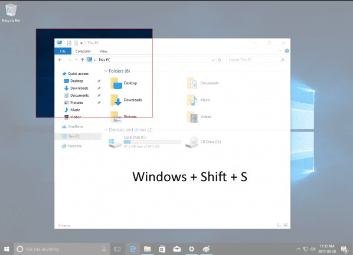
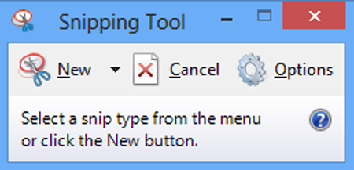
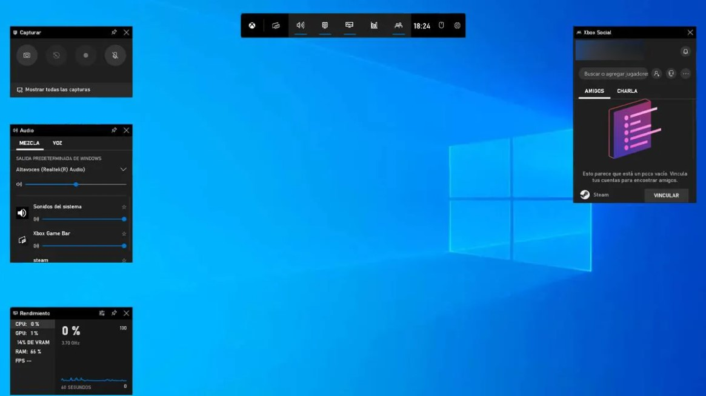

# Как сделать скриншот в Windows 10

## Простейший способ сделать скриншот в Windows 10

В одном из обновлений Windows 10 появился дополнительный способ сделать снимок экрана — комбинация клавиш `Win+Shift+S`. При нажатии этих клавиш, экран затеняется, указатель мыши меняет вид на «крестик» и с помощью него, удерживая левую кнопку мыши, вы можете выделить любую прямоугольную область экрана, скриншот которой нужно сделать.

А в Windows 10 последних версий этот способ еще больше обновился и теперь представляет собой инструмент «Фрагмент и набросок», позволяющий создавать в том числе скриншоты произвольной области экрана и выполнять их простое редактирование. 

После того, как кнопка мыши отпущена, выделенная область экрана помещается в буфер обмена и ее можно вставить в графическом редакторе или в документ.

## Клавиша Print Screen и комбинации с ее участием

Ешё один способ создания скриншота рабочего стола или окна программы в Windows 10 — использование клавиши `Print Screen`, которая на клавиатуре компьютера или ноутбука обычно находится в правой верхней части и может иметь сокращенный вариант подписи, например, `PrtScn`.

При ее нажатии, в буфер обмена (т.е. в память) помещается скриншот всего экрана, который вы затем можете вставить с помощью стандартной комбинации клавиш Ctrl+V в телеграмм, документ word, в качестве изображения в графический редактор Paint для последующего сохранения картинки и почти в любые другие программы, которые поддерживают работу с изображениями.

Если использовать комбинацию клавиш `Alt + Print Screen`, то в буфер обмена будет помещен снимок не всего экрана, а только активного окна программы.

И последний вариант: если вы не хотите иметь дела с буфером обмена, а хотите сделать скриншот сразу в виде изображения, то в Windows 10 можно использовать комбинацию клавиш `Win + Print Screen`. После ее нажатия, скриншот сразу будет сохранен в папку Изображения — Снимки экрана. Вы можете изменить папку сохранения скриншотов по умолчанию.

## Программа создания скриншотов «Ножницы» (snipping tool)

В Windows 10 присутствует стандартная программа Ножницы, которая позволяет легко создавать снимки областей экрана (или всего экрана), в том числе с задержкой, редактировать их и сохранять в нужном формате.

Чтобы запустить приложение `Ножницы (snipping tool)`, найдите его в списке «Все программы», а проще — начните набирать имя приложения в поиске.

После запуска, вам доступны следующие возможности:

Нажав на стрелку в пункте «Создать», вы можете выбрать, какого рода снимок вы хотите сделать — произвольной формы, прямоугольник, весь экран.
В пункте «Задержать» вы можете установить задержу снимка экрана на несколько секунд.
После того, как снимок создан, откроется окно с этим скриншотом, на который вы можете добавить те или иные аннотации с помощью пера и маркера, стереть какую-либо информацию и, конечно, сохранить (в меню файл-сохранить как) в виде файла изображения нужного формата (PNG, GIF, JPG).

Сохранение и редактирование скриншота

## Игровая панель Win + G

В Windows 10 при нажатии комбинации клавиш `Win + G` в программах, развернутых на весь экран, открывается игровая панель, позволяющая записывать экранное видео, а также, если нужно, сделать снимок экрана с помощью соответствующей кнопки на ней или комбинации клавиш (по умолчанию — `Win + Alt + Print Screen`).

Если у вас такая панель не открывается, проверьте настройки стандартного приложения XBOX, управление этой функцией осуществляется именно там, плюс она может не работать в случае, если ваша видеокарта не поддерживается или для нее не установлены драйверы.
